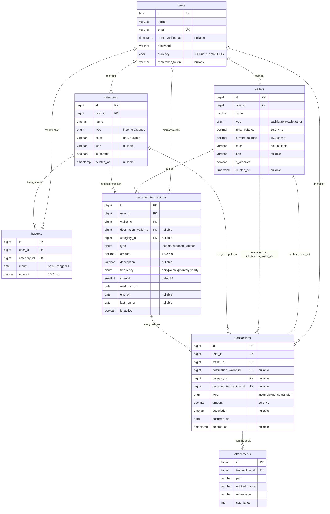

# Database & ERD: Dompetku

> Sumber kebenaran struktur data. Semua nominal bertipe `DECIMAL(15,2)` (mendukung 2 desimal). DILARANG menambah tabel/kolom di luar dokumen ini. Float/double DILARANG untuk uang.

## 1. ERD



Semua tabel memiliki `created_at` dan `updated_at` (tidak ditulis ulang di setiap tabel demi ringkas).

## 2. Definisi Tabel

### 2.1 `users` (Identity)

| Kolom | Tipe | Constraint |
|---|---|---|
| `id` | BIGINT UNSIGNED AI | PK |
| `name` | VARCHAR(100) | NOT NULL |
| `email` | VARCHAR(255) | NOT NULL, UNIQUE |
| `email_verified_at` | TIMESTAMP | NULL |
| `password` | VARCHAR(255) | NOT NULL (hash) |
| `currency` | CHAR(3) | NOT NULL, default 'IDR' (ISO 4217; hanya format tampilan) |
| `remember_token` | VARCHAR(100) | NULL |

### 2.2 `wallets` (Wallet)

| Kolom | Tipe | Constraint |
|---|---|---|
| `id` | BIGINT UNSIGNED AI | PK |
| `user_id` | BIGINT UNSIGNED | FK -> users.id, ON DELETE CASCADE |
| `name` | VARCHAR(50) | NOT NULL |
| `type` | ENUM('cash','bank','ewallet','other') | NOT NULL, default 'other' |
| `initial_balance` | DECIMAL(15,2) | NOT NULL, default 0, CHECK (initial_balance >= 0) |
| `current_balance` | DECIMAL(15,2) | NOT NULL, default 0 (cache, boleh negatif) |
| `color` | VARCHAR(7) | NULL, `#RRGGBB` (default dari palet 05-DESIGN.md) |
| `icon` | VARCHAR(50) | NULL, nama ikon lucide |
| `is_archived` | BOOLEAN | NOT NULL, default false |
| `deleted_at` | TIMESTAMP | NULL |

Index: UNIQUE aplikasi `(user_id, name)` non-deleted (validasi `Rule::unique()->whereNull('deleted_at')`, MySQL tidak punya partial unique index); INDEX `(user_id, is_archived)`.

### 2.3 `categories` (Ledger)

| Kolom | Tipe | Constraint |
|---|---|---|
| `id` | BIGINT UNSIGNED AI | PK |
| `user_id` | BIGINT UNSIGNED | FK -> users.id, ON DELETE CASCADE |
| `name` | VARCHAR(50) | NOT NULL |
| `type` | ENUM('income','expense') | NOT NULL, tidak boleh berubah setelah dipakai transaksi |
| `color` | VARCHAR(7) | NULL |
| `icon` | VARCHAR(50) | NULL |
| `is_default` | BOOLEAN | NOT NULL, default false |
| `deleted_at` | TIMESTAMP | NULL |

Index: UNIQUE aplikasi `(user_id, name, type)` non-deleted; INDEX `(user_id, type)`.

**Kategori default** (di-seed `SeedDefaultCategories` saat registrasi, `is_default = true`, warna & ikon dari 05-DESIGN.md):

- Expense: Makan & Minum, Transportasi, Belanja, Tagihan, Kesehatan, Hiburan, Pendidikan, Lainnya
- Income: Gaji, Bonus, Hadiah, Lainnya

### 2.4 `transactions` (Ledger)

| Kolom | Tipe | Constraint |
|---|---|---|
| `id` | BIGINT UNSIGNED AI | PK |
| `user_id` | BIGINT UNSIGNED | FK -> users.id, ON DELETE CASCADE |
| `wallet_id` | BIGINT UNSIGNED | FK -> wallets.id, ON DELETE RESTRICT |
| `destination_wallet_id` | BIGINT UNSIGNED | NULL, FK -> wallets.id, ON DELETE RESTRICT |
| `category_id` | BIGINT UNSIGNED | NULL, FK -> categories.id, ON DELETE RESTRICT |
| `recurring_transaction_id` | BIGINT UNSIGNED | NULL, FK -> recurring_transactions.id, ON DELETE SET NULL |
| `type` | ENUM('income','expense','transfer') | NOT NULL |
| `amount` | DECIMAL(15,2) | NOT NULL, CHECK (amount > 0) |
| `description` | VARCHAR(255) | NULL |
| `occurred_on` | DATE | NOT NULL |
| `deleted_at` | TIMESTAMP | NULL |

Index: `(user_id, occurred_on)`, `(wallet_id, occurred_on)`, `(category_id)`, `(user_id, type, occurred_on)`, `(recurring_transaction_id, occurred_on)`.

### 2.5 `budgets` (Budget)

| Kolom | Tipe | Constraint |
|---|---|---|
| `id` | BIGINT UNSIGNED AI | PK |
| `user_id` | BIGINT UNSIGNED | FK -> users.id, ON DELETE CASCADE |
| `category_id` | BIGINT UNSIGNED | FK -> categories.id, ON DELETE CASCADE; kategori WAJIB bertipe expense |
| `month` | DATE | NOT NULL, selalu hari pertama bulan (contoh 2026-07-01) |
| `amount` | DECIMAL(15,2) | NOT NULL, CHECK (amount > 0) |

Index: UNIQUE `(user_id, category_id, month)`; INDEX `(user_id, month)`. Tanpa soft delete (hapus = hapus).

### 2.6 `recurring_transactions` (Ledger)

| Kolom | Tipe | Constraint |
|---|---|---|
| `id` | BIGINT UNSIGNED AI | PK |
| `user_id` | BIGINT UNSIGNED | FK -> users.id, ON DELETE CASCADE |
| `wallet_id` | BIGINT UNSIGNED | FK -> wallets.id, ON DELETE CASCADE |
| `destination_wallet_id` | BIGINT UNSIGNED | NULL, FK -> wallets.id, ON DELETE CASCADE |
| `category_id` | BIGINT UNSIGNED | NULL, FK -> categories.id, ON DELETE CASCADE |
| `type` | ENUM('income','expense','transfer') | NOT NULL |
| `amount` | DECIMAL(15,2) | NOT NULL, CHECK (amount > 0) |
| `description` | VARCHAR(255) | NULL |
| `frequency` | ENUM('daily','weekly','monthly','yearly') | NOT NULL |
| `interval` | SMALLINT UNSIGNED | NOT NULL, default 1 (contoh: setiap 2 minggu = weekly + 2) |
| `next_run_on` | DATE | NOT NULL |
| `end_on` | DATE | NULL (NULL = tanpa akhir) |
| `last_run_on` | DATE | NULL |
| `is_active` | BOOLEAN | NOT NULL, default true |

Index: `(is_active, next_run_on)` untuk scheduler; `(user_id)`.

### 2.7 `attachments` (Ledger)

| Kolom | Tipe | Constraint |
|---|---|---|
| `id` | BIGINT UNSIGNED AI | PK |
| `transaction_id` | BIGINT UNSIGNED | FK -> transactions.id, ON DELETE CASCADE |
| `path` | VARCHAR(255) | NOT NULL, path di disk privat, nama file acak (hash) |
| `original_name` | VARCHAR(255) | NOT NULL |
| `mime_type` | VARCHAR(100) | NOT NULL |
| `size_bytes` | INT UNSIGNED | NOT NULL |

Index: `(transaction_id)`. Saat transaksi force-delete/akun dihapus, file fisik ikut dihapus (listener event).

## 3. Aturan Integritas (Application-level Invariants)

Ditegakkan di Action layer; ENUM/CHECK MySQL tidak cukup untuk aturan kondisional:

| # | Invariant |
|---|---|
| I-1 | `type` income/expense => `category_id` NOT NULL, `destination_wallet_id` NULL, dan `categories.type` = `transactions.type` |
| I-2 | `type = 'transfer'` => `destination_wallet_id` NOT NULL, `category_id` NULL, `destination_wallet_id != wallet_id` |
| I-3 | Semua FK (`wallet_id`, `destination_wallet_id`, `category_id`, `recurring_transaction_id`) milik `user_id` yang sama |
| I-4 | `amount > 0` selalu; arah dana ditentukan `type`, bukan tanda nominal; presisi maksimal 2 desimal |
| I-5 | Dompet `is_archived = true` tidak menerima transaksi/recurring baru; histori lamanya tetap dihitung di laporan |
| I-6 | Kategori yang dipakai transaksi/recurring/budget tidak boleh dihapus (tolak dengan pesan jumlah pemakainya) |
| I-7 | Dompet yang punya transaksi (termasuk sebagai destination) atau recurring aktif tidak boleh dihapus; tawarkan arsip. Dompet tanpa keduanya boleh soft delete |
| I-8 | `budgets.category_id` wajib kategori expense milik user; `month` dinormalisasi ke tanggal 1 |
| I-9 | Aturan I-1 dan I-2 berlaku identik untuk `recurring_transactions` |
| I-10 | Maksimal 5 attachment per transaksi |
| I-11 | Recurring generator idempotent: untuk satu recurring dan satu tanggal jatuh tempo, hanya boleh tercipta satu transaksi (cek `recurring_transaction_id` + `occurred_on` sebelum insert) |

## 4. Strategi Saldo Dompet

`wallets.current_balance` adalah **cache** untuk kecepatan dashboard. Sumber kebenaran tetap `transactions`.

```
current_balance = initial_balance
                + SUM(income pada wallet ini)
                - SUM(expense pada wallet ini)
                - SUM(transfer keluar: wallet_id = ini)
                + SUM(transfer masuk: destination_wallet_id = ini)
```

Aturan implementasi:

1. Setiap create/update/delete/restore transaksi (manual maupun dari recurring/import) dibungkus satu `DB::transaction()` yang: (a) `lockForUpdate()` baris wallet terkait, (b) menulis transaksi, (c) memanggil `AdjustWalletBalance` dengan delta. Update transaksi = reverse efek lama, apply efek baru.
2. Aritmetika delta memakai brick/money (basis string), bukan float. Perbandingan nominal di PHP memakai `Money::compareTo`/bccomp.
3. Artisan command `wallets:recalculate {--user=}` menghitung ulang dari rumus di atas untuk recovery.
4. Test wajib: setelah rangkaian operasi acak (create/update/delete/transfer/recurring run/import), `current_balance` identik dengan hasil `wallets:recalculate`, termasuk kasus desimal (contoh 0.10 + 0.20 = 0.30 tepat).
